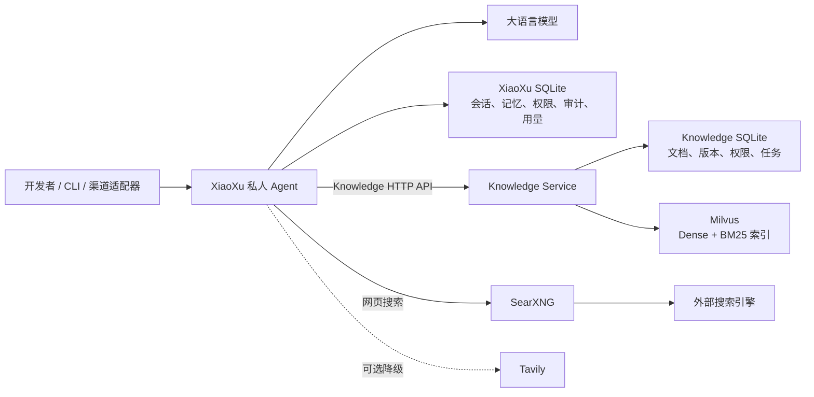

# LangChain 学习与私人 Agent Demo

## 项目简介

本仓库同时包含 LangChain 1.2 的学习材料和一套工程化 Demo。`learn/` 与 `langchain1.2_tutorial/` 用于记录模型、Agent、工具、记忆与 RAG 等能力的学习过程；`Demo/` 则围绕私人 Agent **XiaoXu** 展开，将模型编排、知识库和网页搜索拆分为边界清晰、可独立演进的组件。

当前工程重点是 Demo。它不是一个把所有能力堆在同一进程中的示例，而是通过 HTTP API、独立持久化和明确的数据所有权，展示私人 Agent 如何安全地使用知识检索、网页搜索、Skill、显式长期记忆和权限治理能力。

## 项目目标

- 构建同时支持 CLI 与内部 FastAPI/SSE 接口的私人 Agent，并让不同入口复用同一套模型、工具和持久化资源。
- 将知识库能力封装在独立 Knowledge Service 中，保持固定边界：`XiaoXu --> Knowledge HTTP API --> SQLite/Milvus`。
- 由 Knowledge SQLite 管理知识业务权威状态，由 Milvus 保存可重建的 Dense 与 BM25 检索索引。
- 使用独立的 SearXNG 服务提供网页搜索，并在 XiaoXu 内保留可配置的 Tavily 降级能力。
- 对身份隔离、工具权限、人工审批、审计、会话状态、显式长期记忆和用量统计建立统一治理机制。
- 让 Agent、知识库和搜索服务可以分别维护，避免跨服务读取数据库或共享内部实现。

## 仓库结构

```text
langchain/
├─ learn/                         # LangChain 学习与实验材料
├─ langchain1.2_tutorial/         # 较完整的 LangChain 1.2 教程及配套资源
├─ Demo/
│  ├─ XiaoXu/                    # 私人 Agent、CLI、SSE API、Tools、Skills 与记忆
│  ├─ Milvus/                    # Knowledge Service、知识数据与 Milvus 编排
│  ├─ SearXNG/                   # 独立网页搜索服务及固定镜像归档
│  ├─ VxBot/                     # 当前为空的渠道适配器预留目录
│  └─ Docker命令使用手册.md       # Docker/Compose 操作说明
├─ docs/superpowers/             # 本项目的设计与实施计划
└─ draft.ipynb                   # 独立实验草稿
```

## LangChain 学习内容

学习部分覆盖聊天模型初始化与调用、消息和提示词、Tools、结构化输出、Agent 编排、流式响应、中间件、短期与长期记忆，以及文档加载、切分、Embedding、Milvus 和 RAG 案例。这里主要保留教程 Notebook、示例素材和实验代码；详细学习过程不在本 README 中展开。

## Demo 总体架构



架构的核心不是组件数量，而是边界：XiaoXu 只拥有 Agent 自身状态；Knowledge Service 独占知识库业务与文档处理；Milvus 只接受 Knowledge Service 管理；SearXNG 只负责网页搜索。各组件通过公开接口协作，不把内部数据库当作跨服务通信通道。

## Demo 组件详解

### XiaoXu：私人 Agent 与治理层

`Demo/XiaoXu` 是系统的 Agent 层。`app.py` 负责组合运行时资源，`agent/` 负责编排与中间件，`models/` 负责模型目录和选择状态，`tools/` 提供能力实现，`skills/` 实现渐进式加载，`interfaces/` 提供 CLI 和 FastAPI 入口，`knowledge/` 则是唯一的 Knowledge HTTP 客户端边界。

主要能力包括：

- **统一入口**：CLI 与 `POST /v1/runs` SSE API 共用 Agent factory、模型、Tools、Skills 和持久化资源。API 将处理过程表示为 `run.started`、`response.delta`、`run.completed` 或 `run.failed` 等事件。
- **模型管理**：模型目录保存供应商、模型标识、展示名称和思考能力等非敏感元数据，密钥与服务地址仍由外部环境注入。当前目录包含 DeepSeek 与智谱模型配置。
- **Skill 渐进加载**：启动时只扫描 `SKILL.md` 元数据；模型确定任务匹配后，才通过 `activate_skill` 加载完整说明，并可在受限目录中读取 Skill 资源。
- **知识能力**：`search_knowledge` 是唯一知识检索入口；`get_knowledge_status` 查询当前用户的 Knowledge、Embedding、SQLite 和 Milvus 状态。两者都通过 Knowledge API 工作。
- **网页搜索**：CLI profile 中的 `web_search` 优先访问 SearXNG；请求连续失败、耗尽配置的尝试次数且允许 fallback 时，才会降级到 Tavily。搜索结果保留来源，并标记实际使用的后端。
- **显式长期记忆**：`remember_memory`、`search_memories`、`list_memories`、`update_memory` 和 `forget_memory` 只在用户明确表达记忆意图时使用，不会从普通对话中自动抽取并保存事实。
- **搜索协调**：每个用户轮次维护独立搜索状态，对查询执行 Unicode/空白规范化、重复检测和结果去重；Knowledge 切片按 `(doc_id, chunk_id)` 去重，网页结果按规范化 URL 去重。
- **权限与审计**：所有 LangChain 工具和本地命令都经过同一个执行网关。`PermissionPolicy` 统一给出 allow、ask、deny 判定；需要审批的工具进入 Human-in-the-Loop 流程，执行前后写入审计事件。
- **用量统计**：模型 Token 与工具调用按用户和 UTC 日期写入 `daily_usage`，只用于统计和审计，不设置每日 Token 配额。

工具还受入口 profile 约束：CLI profile 可以使用全部已注册工具；当前 `/v1/runs` 使用 `wecom_chat` allowlist，只开放 Skill、知识检索、知识状态和显式记忆工具，不开放 `web_search`。因此 SearXNG 是当前 CLI Agent 的网页搜索后端，而不是现有渠道 API 的可用工具。

XiaoXu 区分两类记忆状态：

- **checkpoint** 是 thread 级短期对话状态，用于保持多轮上下文。
- **`agent_memories`** 是 user 级显式长期记忆，按用户隔离并按需查询；群聊上下文禁止访问私人长期记忆。

两者都保存在 XiaoXu 自有的 `xiaoxu.db` 中。这个数据库还保存模型状态、权限授权、审计和用量，但不包含知识库文档、切片、Embedding 或向量。XiaoXu 不导入 PyMilvus、不解析知识文档，也不读取 `knowledge.db`。

### Knowledge Service：知识库业务层

`Demo/Milvus` 中的 `knowledge` 服务是独立的 FastAPI/CLI 应用，负责知识库的完整业务生命周期。普通 Token 只允许状态、列表和搜索等只读操作；管理员 Token 才能执行导入、文档变更、删除、导出、恢复与索引重建。

知识入库管线支持 TXT、Markdown、HTML、JSON、CSV、PDF、DOCX、XLSX 和 PPTX，并统一执行：

1. 允许目录与路径边界检查；
2. 文件类型及资源上限校验；
3. 安全解析与结构信息提取；
4. 敏感内容脱敏；
5. 文本分块和元数据生成；
6. BGE-M3 Embedding 与 Milvus 写入；
7. 数量校验和 SQLite 活动版本切换。

批量导入只扫描普通文件，不跟随链接；输入目录保持只读，不支持的文件和处理失败的文件分别复制到独立隔离目录，源文件不会被移动或删除。

Knowledge SQLite 使用 schema v3，负责用户隔离、知识库、文档、版本、活动状态、任务和请求幂等，是知识业务的唯一权威数据源。新版本必须先写入 Milvus 并核对数量，随后才能在 SQLite 事务中激活；未激活或失败残留的向量不会出现在搜索结果中。

服务内部还区分三类并发操作：普通查询共享读锁，导入和文档变更串行提交，导出、恢复和重建使用独占维护锁。这使搜索可以在文档更新期间继续读取旧活动版本，同时避免维护任务与普通请求互相破坏状态。

### Milvus：混合检索索引层

Milvus 以 standalone 模式运行，使用嵌入式 etcd 和本地持久化。逻辑数据库为 `knowledge`，集合为 `knowledge_chunks_v1`。它保存 chunk 内容、检索元数据、1024 维 Dense 向量和 BM25 sparse 向量，但不决定哪个文档版本对用户可见。

Knowledge Service 使用固定 revision 的 `BAAI/bge-m3`，在 `cuda:0` 生成归一化 Dense 向量。检索时分别获得 Dense 与 BM25 候选，再通过 RRF 融合；最终结果还必须经过 owner、knowledge base 和 SQLite 活动版本过滤。默认返回 10 个切片，Dense 与 BM25 各自最多从 50 个候选中参与融合，请求返回量上限为 20。

Milvus 是可由 Knowledge SQLite 活动版本和托管文档重建的索引层。XiaoXu 不持有 Milvus 连接信息，所有查询都必须先经过 Knowledge Service 的身份、版本和业务规则。

### SearXNG：独立网页搜索服务

`Demo/SearXNG` 提供单独的 Compose 项目，固定使用 `searxng/searxng:2026.7.17-2daa4d481` 镜像，并只监听宿主机回环地址。目录同时保存搜索配置、镜像归档清单和 SHA-256 校验信息。

SearXNG 与 Knowledge/Milvus 不共享 Compose 生命周期，也不共享服务名 DNS。XiaoXu 的网页搜索服务负责调用 SearXNG、规范化结果并保留来源；内部的多次后端尝试仍视为一次逻辑搜索。合法的空结果仍属于一次成功的 SearXNG 响应；只有请求持续报错并耗尽尝试次数时，才会按配置尝试 Tavily 降级。

### VxBot：预留渠道适配器

`Demo/VxBot` 当前为空，仅作为渠道适配器的预留目录。XiaoXu 已提供面向渠道集成的 `/v1/runs` SSE 接口和 `wecom_chat` 工具白名单，但本仓库当前没有企业微信连接、消息去重、限流或转发实现，不能把 VxBot 视为已完成或已部署的服务。

## 核心数据流

### Agent 问答链路

1. 用户输入通过 XiaoXu CLI 或 `/v1/runs` SSE API 进入 Agent 层。
2. API 将外部 actor 与会话标识映射为内部用户身份和不可逆的 checkpoint key，原始渠道标识不作为持久化主键。
3. Agent 根据用户意图、当前上下文和入口 profile 决定直接回答，或调用该入口允许的 Skill、记忆、知识检索、知识状态与网页搜索工具。
4. 搜索策略中间件处理查询限次、重复调用和证据去重；执行网关再完成权限判定、审批、审计与用量记录。
5. `search_knowledge` 通过 Knowledge HTTP API 获取当前用户可见的活动版本切片；CLI profile 的 `web_search` 通过 SearXNG 或可选 Tavily 获取网页证据。
6. 模型基于对话和工具证据生成最终文本；API 调用以 SSE 事件流返回结果和稳定错误信息。

### 知识入库链路

1. 管理员通过 Knowledge API 或 `knowledge-admin` 提交允许目录内的文档。
2. Knowledge Service 校验路径、文件类型和资源上限，随后解析内容、提取结构、执行脱敏并分块。
3. BGE-M3 为切片生成 Dense 向量，Milvus 同时保存 Dense、BM25 sparse、文本和检索元数据。
4. Knowledge Service 校验 Milvus 写入数量；成功后在 SQLite 事务中激活新版本。
5. 后续查询只检索当前 owner、knowledge base 和 SQLite 活动版本对应的切片，并将命中内容与来源返回给 XiaoXu。

## 服务与数据边界

| 组件或存储 | 拥有的数据/状态 | 主要职责 | 边界 |
| --- | --- | --- | --- |
| XiaoXu | `xiaoxu.db` 中的 checkpoint、显式记忆、模型状态、权限、审计、用量 | Agent 编排与治理 | 不读取 Knowledge SQLite，不直接访问 Milvus |
| Knowledge Service | `knowledge.db`、托管文档、导入与任务状态 | 知识业务、文档处理、版本与权限 | 通过 HTTP API 对 XiaoXu 提供只读知识能力 |
| Milvus | Dense/BM25 索引、chunk 与检索元数据 | 混合检索索引 | 仅由 Knowledge Service 管理，可从权威数据重建 |
| SearXNG | 搜索配置和自身缓存 | 聚合外部网页搜索 | 不访问 Agent 或知识库数据 |
| VxBot | 当前无数据 | 预留渠道适配器位置 | 当前为空，不属于可运行 Demo 组件 |

可以把最重要的所有权规则概括为：

- XiaoXu 拥有“用户如何与 Agent 交互”的状态。
- Knowledge Service 拥有“哪些知识对哪个用户有效”的状态。
- Milvus 负责“如何高效找到候选切片”，但不拥有业务可见性的最终决定权。
- SearXNG 负责“如何取得网页证据”，不参与 Agent 和记忆状态管理。

## 文档导航

### XiaoXu

- [XiaoXu 概览](Demo/XiaoXu/README.md)
- [XiaoXu 架构](Demo/XiaoXu/docs/architecture.md)
- [XiaoXu API](Demo/XiaoXu/docs/api.md)
- [XiaoXu Tools](Demo/XiaoXu/docs/tools.md)
- [XiaoXu 配置说明](Demo/XiaoXu/docs/configuration.md)
- [XiaoXu 显式长期记忆](Demo/XiaoXu/docs/memory-design.md)
- [XiaoXu Skills](Demo/XiaoXu/docs/skills.md)

### Knowledge Service / Milvus

- [Knowledge Service 概览](Demo/Milvus/README.md)
- [Knowledge/Milvus 架构](Demo/Milvus/docs/architecture.md)
- [Knowledge HTTP API](Demo/Milvus/docs/api.md)
- [Knowledge 运维说明](Demo/Milvus/docs/operations.md)
- [文档导入目录说明](Demo/Milvus/imports/README.md)

### SearXNG 与 Docker

- [SearXNG 概览](Demo/SearXNG/README.md)
- [Docker 命令使用手册](Demo/Docker命令使用手册.md)
