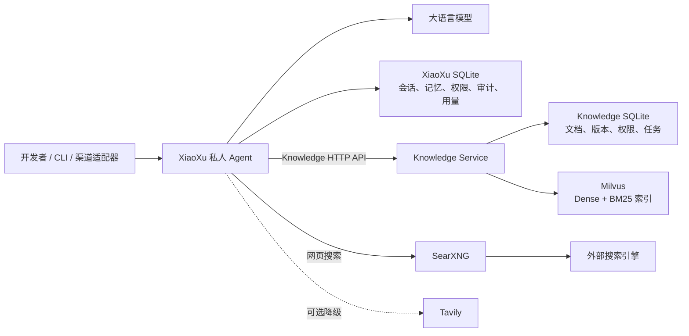

# Root README Implementation Plan

> **For agentic workers:** REQUIRED SUB-SKILL: Use superpowers:subagent-driven-development (recommended) or superpowers:executing-plans to implement this plan task-by-task. Steps use checkbox (`- [ ]`) syntax for tracking.

**Goal:** Create a Chinese root `README.md` that gives incoming developers a concise repository overview and a detailed, source-backed explanation of the Demo architecture, functionality, data flows, and ownership boundaries.

**Architecture:** Add one documentation entry point at the repository root. The README will summarize the two LangChain learning areas briefly, then describe XiaoXu, Knowledge Service/Milvus, SearXNG, the empty VxBot placeholder, the two core data flows, and links to existing detailed documentation without duplicating operational manuals.

**Tech Stack:** Markdown, Mermaid, PowerShell validation, existing Python/FastAPI/LangChain/LangGraph/SQLite/Milvus/SearXNG project documentation.

## Global Constraints

- Write the README in Chinese; preserve source identifiers, paths, environment-variable names, and API paths in English.
- The intended reader is a developer taking over the project.
- Keep LangChain learning content to one short overview section; do not expand tutorial chapters.
- Make Demo the main body of the README.
- Describe only the current checkout. `Demo/VxBot` is empty and must be labeled as a reserved placeholder, not an implemented service.
- Preserve the boundary `XiaoXu -> Knowledge HTTP API -> SQLite/Milvus`; XiaoXu never connects directly to Knowledge SQLite or Milvus.
- Do not add environment setup, configuration tutorials, startup commands, test commands or counts, health checks, troubleshooting, Docker operations, volume recovery, or live-runtime claims.
- Do not modify application code, configuration, existing subproject documentation, persistent data, or the user's untracked `AI-Agent中级模拟面试题.md`.

---

### Task 1: Create and validate the root developer-handoff README

**Files:**
- Create: `README.md`
- Reference: `docs/superpowers/specs/2026-08-21-root-readme-design.md`
- Reference: `Demo/XiaoXu/README.md`
- Reference: `Demo/XiaoXu/docs/architecture.md`
- Reference: `Demo/XiaoXu/docs/tools.md`
- Reference: `Demo/XiaoXu/docs/memory-design.md`
- Reference: `Demo/Milvus/README.md`
- Reference: `Demo/Milvus/docs/architecture.md`
- Reference: `Demo/Milvus/docs/api.md`
- Reference: `Demo/SearXNG/README.md`
- Test: PowerShell documentation assertions; no new test file

**Interfaces:**
- Consumes: Current repository structure, source-backed component boundaries, and the approved README design.
- Produces: Root `README.md`, serving as the handoff overview and navigation entry point for the repository.

- [ ] **Step 1: Run the failing documentation-entry assertion**

Run:

```powershell
if (-not (Test-Path -LiteralPath '.\README.md')) {
    throw 'Root README is missing.'
}
```

Expected: FAIL with `Root README is missing.` This proves the requested root documentation entry point does not exist before implementation.

- [ ] **Step 2: Create the README with the approved information architecture**

Create `README.md` with this exact section order:

```markdown
# LangChain 学习与私人 Agent Demo

## 项目简介
## 项目目标
## 仓库结构
## LangChain 学习内容
## Demo 总体架构
## Demo 组件详解
### XiaoXu：私人 Agent 与治理层
### Knowledge Service：知识库业务层
### Milvus：混合检索索引层
### SearXNG：独立网页搜索服务
### VxBot：预留渠道适配器
## 核心数据流
### Agent 问答链路
### 知识入库链路
## 服务与数据边界
## 文档导航
```

The content must include:

- A one-paragraph project summary distinguishing learning materials from the engineering Demo.
- A concise goal list covering the private Agent, the Knowledge HTTP boundary, SQLite/Milvus responsibilities, independent web search, and governance.
- A directory tree for `learn`, `langchain1.2_tutorial`, `Demo/XiaoXu`, `Demo/Milvus`, `Demo/SearXNG`, `Demo/VxBot`, and `Demo/Docker命令使用手册.md`.
- One short learning-material paragraph covering models, messages/prompts, tools, structured output, Agents, middleware, memory, and RAG without chapter-by-chapter explanations.
- A Mermaid flowchart containing the current logical relations:



- Source-backed component descriptions covering XiaoXu entry points, models, Tools, Skills, permission/audit gateway, short-term checkpoints, explicit long-term memory, Knowledge API separation, multi-format ingestion, redaction, BGE-M3, SQLite active versions, Dense/BM25 plus RRF retrieval, independent SearXNG, optional Tavily fallback, and the empty VxBot directory.
- Numbered Agent-question and knowledge-ingestion flows matching the approved design.
- A compact ownership table distinguishing XiaoXu SQLite, Knowledge SQLite, Milvus, SearXNG, and VxBot.
- Relative links to the existing XiaoXu, Milvus, SearXNG, and Docker-manual documents named in the design specification.

- [ ] **Step 3: Run structural and scope assertions**

Run:

```powershell
$content = Get-Content -LiteralPath '.\README.md' -Raw -Encoding UTF8

$required = @(
    '# LangChain 学习与私人 Agent Demo',
    '## Demo 总体架构',
    '### XiaoXu：私人 Agent 与治理层',
    '### Knowledge Service：知识库业务层',
    '### Milvus：混合检索索引层',
    '### SearXNG：独立网页搜索服务',
    '### VxBot：预留渠道适配器',
    '## 核心数据流',
    '## 服务与数据边界',
    'XiaoXu --> Knowledge HTTP API --> SQLite/Milvus'
)
foreach ($item in $required) {
    if (-not $content.Contains($item)) {
        throw "README is missing required content: $item"
    }
}

$forbiddenHeadings = @(
    '## 快速开始',
    '## 环境配置',
    '## 测试',
    '## 故障排查',
    '## Docker 运维'
)
foreach ($heading in $forbiddenHeadings) {
    if ($content.Contains($heading)) {
        throw "README contains excluded section: $heading"
    }
}

if (-not $content.Contains('当前为空')) {
    throw 'README must state that Demo/VxBot is currently empty.'
}
```

Expected: command completes with no output.

- [ ] **Step 4: Validate every relative Markdown link**

Run:

```powershell
$content = Get-Content -LiteralPath '.\README.md' -Raw -Encoding UTF8
$links = [regex]::Matches($content, '\[[^\]]+\]\(([^)]+)\)')
foreach ($match in $links) {
    $target = $match.Groups[1].Value
    if ($target -match '^(https?://|#)') {
        continue
    }
    $decoded = [System.Uri]::UnescapeDataString($target)
    $path = Join-Path (Get-Location) $decoded
    if (-not (Test-Path -LiteralPath $path)) {
        throw "Broken local README link: $target"
    }
}
```

Expected: command completes with no output.

- [ ] **Step 5: Review the final documentation diff**

Run:

```powershell
git diff --check
git diff -- README.md
git status --short
```

Expected: `git diff --check` reports no whitespace errors; the diff contains only the new README; status still lists the user's unrelated untracked document unchanged.

- [ ] **Step 6: Commit the README**

Run:

```powershell
git add -- README.md
git commit -m "docs: add project overview readme"
```

Expected: one documentation commit containing only `README.md`.
