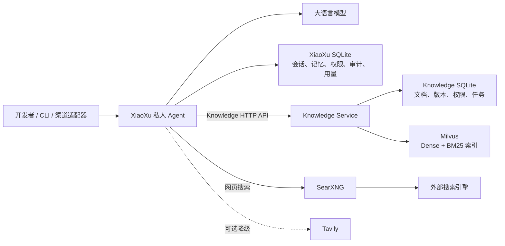

# 根目录 README 设计

## 目标

在仓库根目录创建 `README.md`，面向接手项目的开发者说明项目定位、仓库组成、Demo 的功能与架构边界，使读者无需逐个阅读源码即可建立准确的整体认识。

README 是项目总览和文档入口，不承担部署手册、测试手册或故障排查手册的职责。

## 读者

主要读者是首次接手本仓库、需要理解现状并继续开发的工程师。内容应优先回答以下问题：

1. 这个仓库解决什么问题，当前重点是什么？
2. 学习材料和工程化 Demo 分别位于哪里？
3. Demo 中各组件负责什么，彼此如何通信？
4. 用户问答与知识入库分别经过哪些环节？
5. 数据、权限和持久化分别由哪个组件拥有？
6. 需要深入时应该继续阅读哪些子项目文档？

## 写作原则

- 使用中文撰写，技术标识、环境变量和路径保留源码中的英文名称。
- LangChain 学习内容只用一个简短章节概括覆盖主题，不展开教学内容或逐章说明。
- Demo 是 README 主体，详细说明 XiaoXu、Knowledge Service、Milvus、SearXNG，以及当前为空的 VxBot 目录。
- 所有结论以当前仓库源码、配置和现有子项目文档为准，不把历史项目状态写成当前事实。
- 明确区分已经存在的实现与预留位置。`Demo/VxBot` 当前为空，只能描述为预留渠道适配器目录。
- 使用 Mermaid 展示总体架构，正文补充 Mermaid 无法完整表达的职责、数据所有权和一致性边界。
- 避免重复子项目 README 的全部细节；根 README 给出足够的整体理解，并链接到更详细的文档。

## README 内容结构

### 1. 项目概述

说明仓库同时包含 LangChain 1.2 学习材料和工程化 Demo。学习材料用于理解模型、消息与提示词、工具、结构化输出、Agent、中间件、记忆和 RAG；Demo 用于实践一个具备私有 Agent、知识库和网页搜索能力的系统。

### 2. 项目目标

概括 Demo 的核心目标：

- 提供可独立运行的私人 Agent，并同时支持 CLI 和内部 FastAPI/SSE 接口。
- 将知识库能力放在独立 Knowledge HTTP 服务中，保持 Agent 与数据层解耦。
- 使用 SQLite 管理知识业务状态，使用 Milvus 保存 Dense 与 BM25 检索索引。
- 通过独立 SearXNG 服务提供网页搜索，并保留 XiaoXu 内部的可选 Tavily 降级能力。
- 对工具权限、审计、会话、显式长期记忆和用量统计建立清晰边界。

### 3. 仓库结构

使用简洁目录树介绍：

- `learn/`：较早的一套 LangChain 学习与实验材料。
- `langchain1.2_tutorial/`：更完整的 LangChain 1.2 教程和配套资源。
- `Demo/XiaoXu/`：私人 Agent、CLI、FastAPI/SSE、Tools、Skills、记忆和治理能力。
- `Demo/Milvus/`：Knowledge Service、SQLite 业务数据、Milvus 索引和文档处理管线。
- `Demo/SearXNG/`：独立网页搜索服务及固定镜像归档。
- `Demo/VxBot/`：当前为空的渠道适配器预留目录。
- `Demo/Docker命令使用手册.md`：独立的 Docker/Compose 运维说明，不在根 README 中重复展开。

### 4. Demo 总体架构

README 使用下列逻辑关系绘制 Mermaid 图：

图后使用组件职责表说明每个组件的定位、主要能力、拥有的数据和对外边界。

### 5. XiaoXu

详细介绍以下内容：

- 由 `app.py` 组合运行时，Agent factory 统一创建 CLI/API 共用的模型、工具和持久化资源。
- CLI 与 `POST /v1/runs` SSE API 是两种入口；API 还提供存活和就绪检查。
- 模型由目录配置和运行状态管理，支持不同供应商模型及思考能力元数据。
- 工具包括 Skill 激活与资源读取、知识检索、知识状态、网页搜索，以及显式长期记忆的增删改查。
- CLI 工具集合与 `wecom_chat` 工具集合存在渠道级 allowlist；当前 API 可供未来渠道适配器调用，但仓库中没有 VxBot 实现。
- 所有工具经过统一执行网关，应用 allow/ask/deny 权限判定、审计和调用计数。
- 模型与工具 Token/调用数据只用于统计和审计，不设置日配额。
- checkpoint 保存 thread 级短期会话；`agent_memories` 保存 user 级显式长期记忆；两者都属于 XiaoXu 自有 SQLite。
- XiaoXu 不解析知识文档、不导入 PyMilvus、不读取 Knowledge SQLite，也不执行知识库写操作。

### 6. Knowledge Service 与 Milvus

详细介绍以下内容：

- Knowledge Service 是独立 FastAPI/CLI 服务；Milvus 是其内部索引存储，不是 XiaoXu 的直接依赖接口。
- 普通 Token 支持状态、知识库列表、文档列表和搜索；管理员 Token 支持导入、文档变更、删除、导出、恢复和重建。
- 文档管线支持 TXT、Markdown、HTML、JSON、CSV、PDF、DOCX、XLSX 和 PPTX，并统一执行路径限制、资源限制、安全解析、脱敏与分块。
- BGE-M3 使用固定 revision，在 `cuda:0` 生成 1024 维归一化 Dense 向量；Milvus 同时保存 Dense 与 BM25 sparse 索引。
- 检索先分别获取 Dense 与 BM25 候选，再以 RRF 融合，并按用户、知识库和 SQLite 活动版本过滤。
- SQLite schema v3 是用户隔离、知识库、文档、版本、状态和导入幂等性的权威来源；Milvus 行通过业务标识与 SQLite 关联。
- 新版本先写入并校验 Milvus，再在 SQLite 事务中激活；失败或未激活的向量不会被搜索命中。
- 只读 imports、托管文档、SQLite 运行数据和 Milvus named volume 的数据所有权彼此区分。

### 7. SearXNG

说明 SearXNG 是独立 Compose 服务，固定镜像版本，仅监听宿主机回环地址。XiaoXu 的 `web_search` 优先调用 SearXNG，并可按配置降级到 Tavily。SearXNG 与 Knowledge/Milvus 不在同一 Compose 项目中，不共享服务名 DNS 或生命周期。

### 8. 核心数据流

README 用编号步骤讲清两条链路：

#### Agent 问答链路

1. 用户输入通过 CLI 或 `/v1/runs` 进入 XiaoXu。
2. API 调用完成渠道身份到内部用户与 checkpoint key 的映射。
3. Agent 根据模型判断调用 Skill、记忆、知识检索或网页搜索工具。
4. 权限、中间件和执行网关完成审批、限次、去重、审计与用量记录。
5. `search_knowledge` 通过 Knowledge HTTP API 检索；`web_search` 通过 SearXNG 或可选 Tavily 检索。
6. 模型基于工具证据生成最终结果；API 以 SSE 事件流返回。

#### 知识入库链路

1. 管理员通过 Knowledge API 或 `knowledge-admin` 提交允许目录内的文档。
2. Knowledge Service 执行安全检查、解析、资源限制、脱敏与分块。
3. BGE-M3 生成 Dense 向量，Milvus 保存 Dense、BM25 sparse 与检索元数据。
4. 写入数量校验成功后，SQLite 激活新版本。
5. 后续搜索只查询当前用户可见的活动版本。

### 9. 服务与数据边界

使用表格明确：

- XiaoXu SQLite 只保存 Agent 会话、模型状态、权限、审计、用量和显式记忆。
- Knowledge SQLite 只保存知识库业务权威状态。
- Milvus 只保存可重建的检索索引和切片元数据。
- SearXNG 只负责网页搜索，不访问 Agent 或知识库数据。
- VxBot 目录当前没有实现，不能视为已部署服务。

### 10. 文档导航

链接到以下现有文档：

- `Demo/XiaoXu/README.md`
- `Demo/XiaoXu/docs/architecture.md`
- `Demo/XiaoXu/docs/api.md`
- `Demo/XiaoXu/docs/tools.md`
- `Demo/XiaoXu/docs/memory-design.md`
- `Demo/Milvus/README.md`
- `Demo/Milvus/docs/architecture.md`
- `Demo/Milvus/docs/api.md`
- `Demo/Milvus/docs/operations.md`
- `Demo/SearXNG/README.md`
- `Demo/Docker命令使用手册.md`

## 明确排除的内容

根据用户确认，根 README 不包含以下内容：

- 详细环境准备或依赖安装步骤。
- `.env` 配置教程或密钥生成说明。
- Docker/Compose 启动、停止、重建命令。
- 测试命令、测试数量或本次运行状态。
- 健康检查、故障排查和运维流程。
- 数据卷操作或恢复步骤。
- LangChain 教程章节的详细介绍。

这些内容继续由子项目 README、`docs/` 文档和 Docker 命令手册承载。

## 验收标准

- 根目录生成一个 UTF-8 编码的 `README.md`。
- LangChain 学习内容保持简短，Demo 占据 README 主体。
- 架构图能够准确表达 XiaoXu、Knowledge Service、Milvus、SearXNG 与外部调用方的关系。
- 组件描述、数据流和数据所有权与当前源码和配置一致。
- 不把 `Demo/VxBot` 或历史 WxBot 能力写成当前实现。
- 不包含已明确省略的启动、配置、测试、排错或运维章节。
- 所有相对文档链接在当前仓库中可解析。
- 文档不存在 `TODO`、`TBD`、占位文本或未经验证的运行状态声明。
